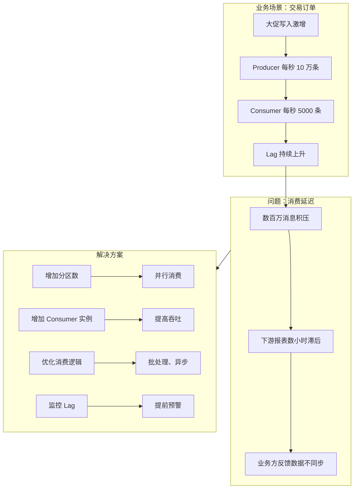

# 案例 01：消费延迟（Consumer Lag）

## 图示：场景 → 问题 → 解决方案

## 业务需求场景

**交易系统 Kafka 消费延迟**

某金融交易系统使用 Kafka 传递订单、成交等消息，下游消费组负责落库并生成报表。大促期间：

- Producer 写入激增，每秒约 **10 万条** 消息
- Consumer 组仅有 3 个实例，单实例处理能力约 5000 条/秒
- **Consumer Lag** 从数百迅速攀升到数百万
- 下游报表延迟数小时，业务方反馈「数据不同步」

## 涉及的技术概念

- **Consumer Lag**：消费者当前 offset 与分区最新 offset 的差值，表示积压消息数
- **分区数**：决定消费并行度，分区数限制最大消费者数
- **消费吞吐**：受消费逻辑、IO、网络等影响

## 对业务的影响

- **直接影响**：报表不准、风控延迟、用户看到过期数据
- **间接影响**：决策延迟、合规风险

## 解决方案要点

1. **监控 Lag**：接入 Lag 监控，设置阈值告警
2. **增加分区和消费者**：分区数 ≥ 消费者实例数，才能充分发挥并行
3. **优化消费逻辑**：批处理、异步化、避免同步调用外部 API

## 学习要点

理解「生产速率 > 消费速率」会导致 Lag 积压，掌握通过分区扩展和消费优化提升吞吐的思路。
