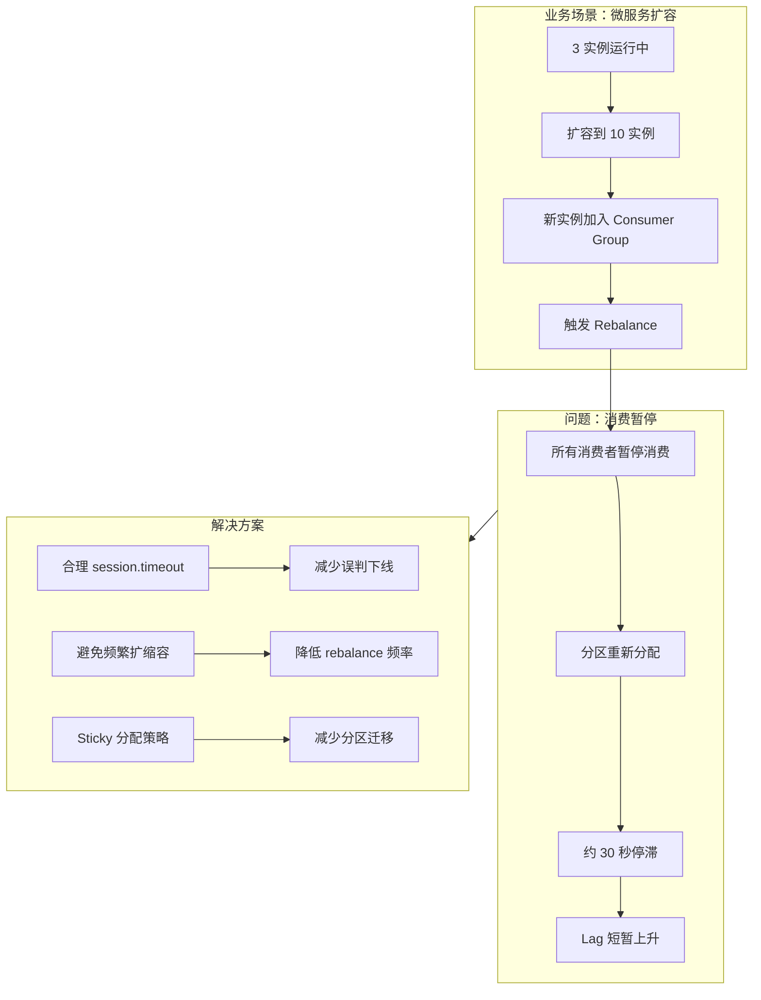

# 案例 02：分区重平衡（Rebalance）

## 图示：场景 → 问题 → 解决方案

## 业务需求场景

**微服务扩容触发 Rebalance**

某订单处理服务由 3 个实例组成 Kafka 消费组，目前共有 6 个分区。大促前扩容到 10 个实例：

- 新实例启动后加入 Consumer Group
- Kafka 触发 **Rebalance**，所有分区需重新分配
- 在 rebalance 期间，**所有消费者暂停消费**约 30 秒
- 消息短暂积压，部分接口超时

## 涉及的技术概念

- **Rebalance**：消费者数量变化时，分区需重新分配给各消费者
- **session.timeout**：心跳超时视为消费者下线，触发 rebalance
- **max.poll.interval**：两次 poll 间隔过长也会触发 rebalance

## 对业务的影响

- **直接影响**：rebalance 期间消费暂停，Lag 上升
- **间接影响**：频繁 rebalance 会降低整体吞吐

## 解决方案要点

1. 合理设置 **session.timeout**、**max.poll.interval**，避免误判
2. 避免频繁扩缩容，尽量一次性调整到目标实例数
3. 使用 **Sticky 分配策略**（Kafka 2.4+）减少不必要的分区迁移

## 学习要点

理解 Rebalance 的触发条件和代价，掌握通过参数调优减少 rebalance 的思路。
