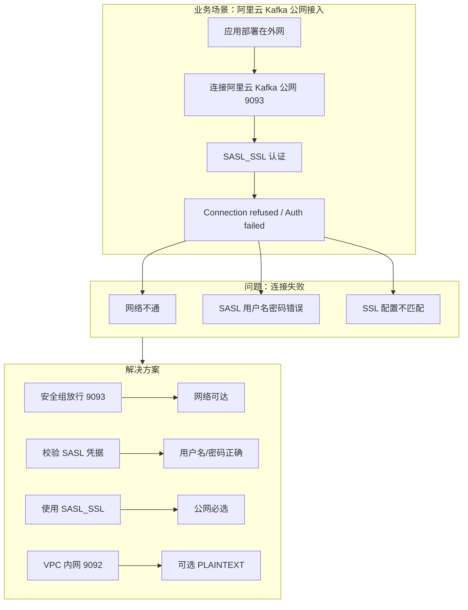

# 案例 03：连接失败（SASL/SSL）

## 图示：场景 → 问题 → 解决方案

## 业务需求场景

**阿里云 Kafka 公网连接失败**

开发环境在本机，需连接阿里云 Kafka 进行调试。使用公网接入地址（9093 端口）：

- 应用启动时报 **Connection refused** 或 **SASL authentication failed**
- 控制台已创建实例，并开启了公网接入

## 涉及的技术概念

- **VPC 9092**：内网 PLAINTEXT，仅同 VPC 可访问
- **公网 9093**：SASL_SSL，需配置用户名、密码
- **SASL 用户名**：阿里云格式如 `alikafka_post-cn-xxx`

## 对业务的影响

- **直接影响**：应用无法连接 Kafka，无法生产/消费
- **间接影响**：开发调试受阻、部署失败

## 解决方案要点

1. **网络**：安全组放行 9092（VPC）或 9093（公网）
2. **SASL**：公网 9093 必须配置 SASL 用户名、密码
3. **地址**：使用控制台提供的完整 Broker 列表（多节点逗号分隔）

## 学习要点

理解 VPC 与公网两种接入方式，以及 SASL_SSL 在公网场景下的必要性。
