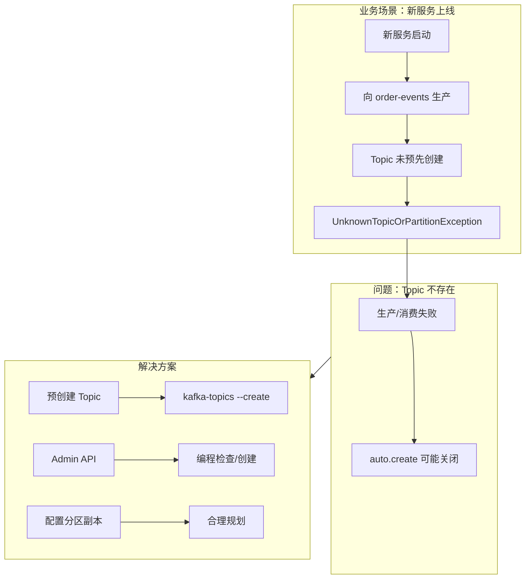

# 案例 04：Topic 不存在

## 图示：场景 → 问题 → 解决方案

## 业务需求场景

**新服务向未创建 Topic 生产**

某订单服务首次上线，代码中配置向 Topic `order-events` 生产消息：

- 应用启动后立即生产，报 **UnknownTopicOrPartitionException**
- 集群 `auto.create.topics.enable` 为 false，或等待超时

## 涉及的技术概念

- **Topic**：Kafka 消息的逻辑分区单位
- **auto.create.topics.enable**：是否允许自动创建 Topic
- **分区数、副本数**：创建 Topic 时需指定

## 对业务的影响

- **直接影响**：应用无法生产/消费，启动失败

## 解决方案要点

1. **预创建 Topic**：使用 `kafka-topics.sh --create` 或 Admin API
2. **运维流程**：新 Topic 纳入上线检查项
3. **分区与副本**：根据吞吐和可用性需求合理配置

## 学习要点

理解 Topic 需显式创建（或依赖自动创建），掌握创建 Topic 的常见方式。
