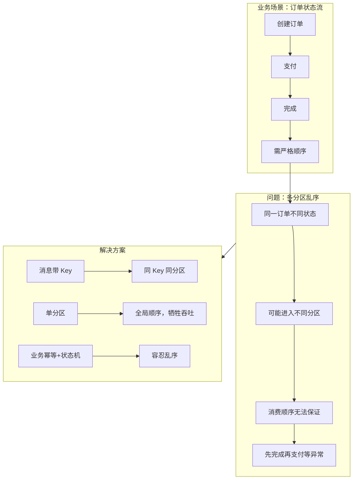

# 案例 05：消息顺序

## 图示：场景 → 问题 → 解决方案

## 业务需求场景

**订单状态变更需严格顺序**

订单生命周期：创建 → 支付 → 完成。下游消费需按此顺序处理，否则会出现「先完成再支付」等逻辑错误。

- Topic 有多个分区，Kafka 按 **key 的 hash** 决定分区
- 若生产时未设置 key，或 key 不一致，同一订单的不同状态可能进入不同分区
- 不同分区由不同消费者处理，**无法保证全局顺序**

## 涉及的技术概念

- **分区与顺序**：同一分区内消息有序；分区间无序
- **消息 Key**：相同 key 的消息会进入同一分区
- **消费者并行度**：分区数决定最大并行消费者数

## 对业务的影响

- **直接影响**：下游状态机异常、业务逻辑错误

## 解决方案要点

1. **使用 Key**：以订单 ID 为 key，确保同一订单的消息进入同一分区
2. **单分区**：严格要求全局顺序时可用单分区，但吞吐受限
3. **业务层**：幂等 + 状态机，容忍乱序到达

## 学习要点

理解「分区内有序、分区间无序」，掌握通过 key 控制同业务实体进同一分区的做法。
