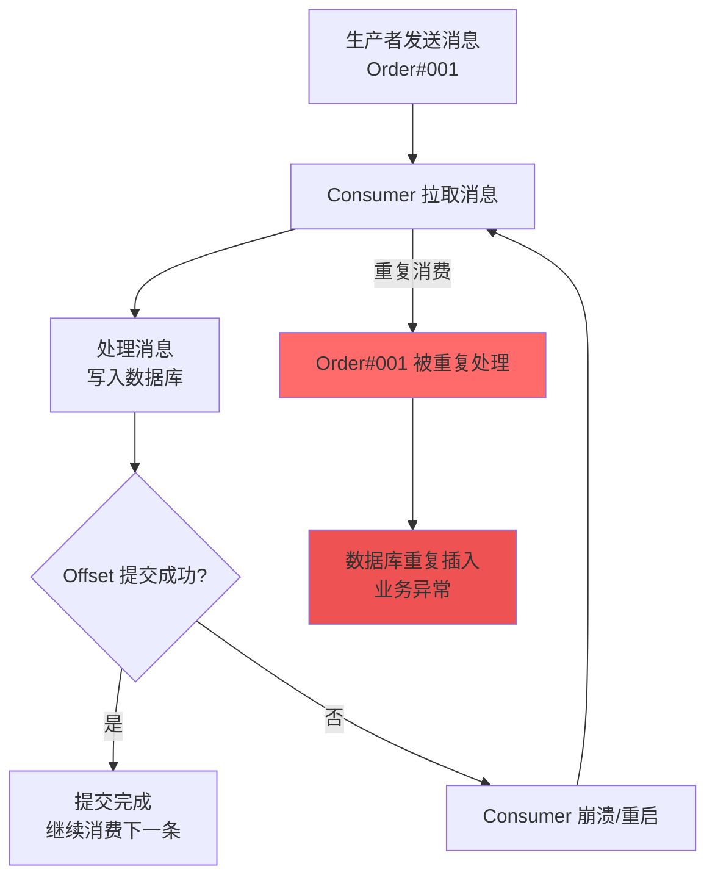
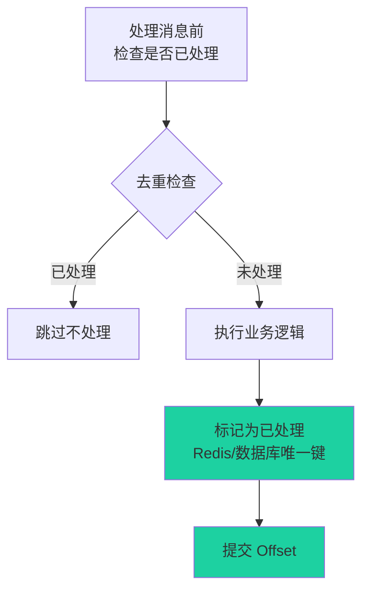

# 案例 06：消息重复消费

## 图示：场景 → 问题 → 解决方案



### 解决方案



## 业务需求场景

某电商平台的订单处理系统使用 Kafka 消费订单消息。当消费者处理完订单消息后、提交 Offset 之前，进程异常退出或发生 Rebalance。系统重启后，同一批订单消息被重新消费，导致：

1. **重复扣款**：用户被重复扣款
2. **重复发货**：同一订单被多次发货
3. **数据不一致**：库存被多次扣减

这是典型的「At-least-once」语义导致的重复消费问题。

## 涉及的技术概念

### 1. Consumer Offset 提交机制

Kafka Consumer 会定期提交当前消费位置（Offset）。提交方式有两种：

- **自动提交**（默认）：`enable.auto.commit=true`，由 `auto.commit.interval.ms` 控制提交间隔
- **手动提交**：`enable.auto.commit=false`，由用户代码调用 `consumer.Commit()` 或 `consumer.CommitAsync()`

**问题场景**：处理完消息后、提交 Offset 前消费者崩溃，导致重启后重新消费。

### 2. At-least-once 语义

Kafka 默认提供「至少一次」投递语义：

- **可能丢消息**：生产者 `acks=0` 或 `acks=1` 且 Leader 崩溃
- **可能重复**：消费者处理完但未提交 Offset 就崩溃

### 3. 幂等性处理

解决重复消费的核心思路：

- **业务幂等**：在数据库层利用唯一键约束
- **去重机制**：处理前检查是否已处理（Redis 缓存、数据库唯一索引）
- **精确一次**：Kafka 事务 + 幂等 Producer（`enable.idempotence=true`）

### 4. Rebalance 触发重复消费

当 Consumer Group 发生 Rebalance 时：

1. 正在处理的消息可能被中断
2. 分区重新分配后，原来处理过的消息可能被重新消费
3. `max.poll.interval.ms` 设置过小会导致频繁 Rebalance

## 对业务的影响

| 影响类型 | 具体表现 |
|---------|---------|
| **资金损失** | 重复扣款、重复退款 |
| **运营问题** | 重复发货、重复通知 |
| **数据错误** | 统计报表数据翻倍 |
| **用户体验** | 投诉增加、信任度下降 |
| **资源浪费** | 重复计算、重复存储 |

## 与 kafka-ops-learning 的对应

### 案例 ID：06-duplicate-consumption

### 实现路径

```bash
cd kafka-ops-learning
go run ./cmd run 06-duplicate-consumption info
go run ./cmd run 06-duplicate-consumption analyze
```

### 功能说明

| Action | 功能 |
|--------|------|
| `info` | 展示消息重复消费的概念、原因、关键配置、避免方法 |
| `analyze` | 分析当前 Consumer Group 的 Offset 提交状态，识别潜在重复消费风险 |

### 环境变量

```bash
KAFKA_BROKERS=localhost:9092      # Kafka Broker 地址
KAFKA_GROUP=order-consumer        # Consumer Group 名称（可选）
KAFKA_TOPIC=order-events          # Topic 名称（可选）
```

## 学习要点

### 1. 理解 Offset 提交时机

- **先处理后提交**：确保消息处理成功后再提交
- **失败不提交**：处理失败时不提交，重启后可重试
- **批量处理小心**：批量处理时，部分成功部分失败如何处理？

### 2. 业务层幂等设计

```go
// 示例：利用 Redis 去重
func processOrder(orderID string) error {
    // 检查是否已处理
    exists, _ := redis.Exists(ctx, "processed:"+orderID).Result()
    if exists {
        log.Printf("订单 %s 已处理，跳过", orderID)
        return nil
    }

    // 处理订单
    err := doProcess(orderID)
    if err != nil {
        return err
    }

    // 标记已处理（设置过期时间）
    redis.Set(ctx, "processed:"+orderID, "1", 24*time.Hour)
    return nil
}
```

### 3. 合理配置参数

```properties
# 推荐配置
enable.auto.commit=false          # 手动提交，更精确控制
max.poll.records=100              # 每次拉取适量消息
session.timeout.ms=30000          # 合理的心跳超时
max.poll.interval.ms=300000       # 两次 poll 间隔上限
heartbeat.interval.ms=10000       # 心跳间隔
```

### 4. 监控与告警

- 监控同一消息被处理的次数
- 监控 Consumer Group Rebalance 频率
- 监控 Offset 提交失败率

### 5. 根本解决方案

| 方案 | 复杂度 | 适用场景 |
|-----|--------|---------|
| 业务幂等 | 低 | 通用，推荐优先 |
| 分布式锁 | 中 | 需要强一致性 |
| Kafka 事务 | 高 | 多分区原子写入 |
| 精确一次幂等 | 中 | Producer 端 |

---

**总结**：消息重复消费是分布式系统的经典问题。Kafka 默认的 At-least-once 语义下，重复不可避免。**业务层幂等设计**是最可靠、成本最低的解决方案。
