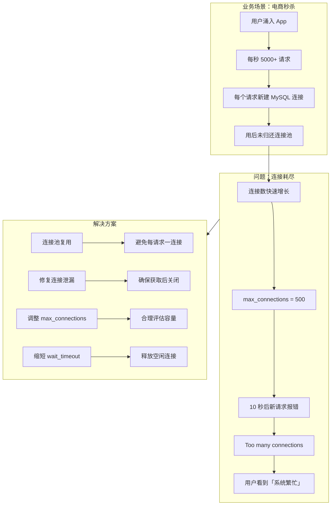

# 案例 01：最大连接数耗尽

## 图示：场景 → 问题 → 解决方案

## 业务需求场景

**电商平台大促秒杀**

某电商平台在双 11 大促期间推出限时秒杀活动。活动开始前 5 分钟，大量用户涌入 App 等待抢购。活动开始瞬间：

- 后台服务收到每秒 **5000+ 请求**
- 每个 HTTP 请求处理时，应用都 **新建一个 MySQL 连接**，用完后未正确归还连接池
- 数据库 `max_connections` 配置为 500
- 约 10 秒后，**新请求全部报错**："Too many connections"
- 用户界面显示"系统繁忙，请稍后再试"
- 客服接到大量投诉，活动被迫暂停

## 涉及的技术概念

- **max_connections**：MySQL 允许的最大并发连接数
- **连接池**：应用预先创建若干连接，请求复用而非每次新建
- **Threads_connected**：当前已建立的连接数
- **连接泄漏**：应用获取连接后未关闭，连接一直占用

## 对业务的影响

- **直接影响**：用户无法下单、无法登录、无法查看商品
- **间接影响**：订单流失、品牌形象受损、售后成本增加
- **量化示例**：若每秒流失 100 笔订单、客单价 200 元，10 分钟损失约 120 万

## 与 mysql-ops-learning 的对应

| 工具操作 | 作用 |
|----------|------|
| Run: 模拟耗尽 | 持续创建连接直至达到上限，模拟大促时的连接耗尽 |
| Run: 查看状态 | 查看 Threads_connected、Max_used_connections，评估连接使用情况 |

## 学习要点

理解「每个请求一连接」在高并发下会导致连接数快速耗尽，从而理解连接池和合理配置 max_connections 的必要性。
