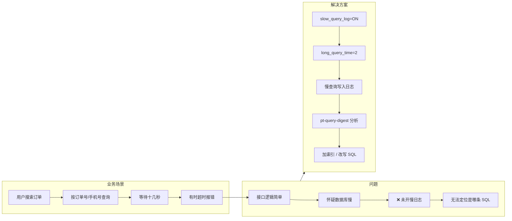

# 案例 02：慢查询监控

## 图示：场景 → 问题 → 解决方案

## 业务需求场景

**用户搜索订单反馈很慢**

某 O2O 平台的用户在「我的订单」页面搜索历史订单，按订单号或手机号查询。上线一段时间后，客服收到反馈：

- "输入订单号点搜索，要等 **十几秒** 才能出结果"
- "有时候直接超时，显示网络错误"
- 技术排查：接口逻辑简单，怀疑是数据库慢，但 **不知道具体是哪条 SQL**

DBA 查看监控发现数据库 CPU 偶发飙高，但无法对应到具体语句。因为未开启慢查询日志，无法定位问题 SQL。

## 涉及的技术概念

- **slow_query_log**：记录执行时间超过阈值的 SQL
- **long_query_time**：慢查询阈值（秒），如 2 表示超过 2 秒的查询会被记录
- **慢日志分析**：pt-query-digest 等工具可汇总、排序慢查询

## 对业务的影响

- **直接影响**：用户搜索订单、查看详情等操作卡顿或超时
- **间接影响**：用户认为系统"不稳定"，投诉增多，可能转向竞品
- **排查难点**：未开慢日志时，无法快速定位是哪条 SQL 导致，只能靠经验猜

## 与 mysql-ops-learning 的对应

| 工具操作 | 作用 |
|----------|------|
| Run: 模拟慢查询 | 执行 `SELECT SLEEP(5)`，模拟一条慢查询，用于验证慢日志是否生效 |
| Run: 开启慢日志 | 设置 `slow_query_log=1`、`long_query_time=2`，并显示当前配置 |

## 学习要点

理解慢日志是定位性能问题的前提，只有先开启并分析慢日志，才能有针对性地加索引或改写 SQL。
