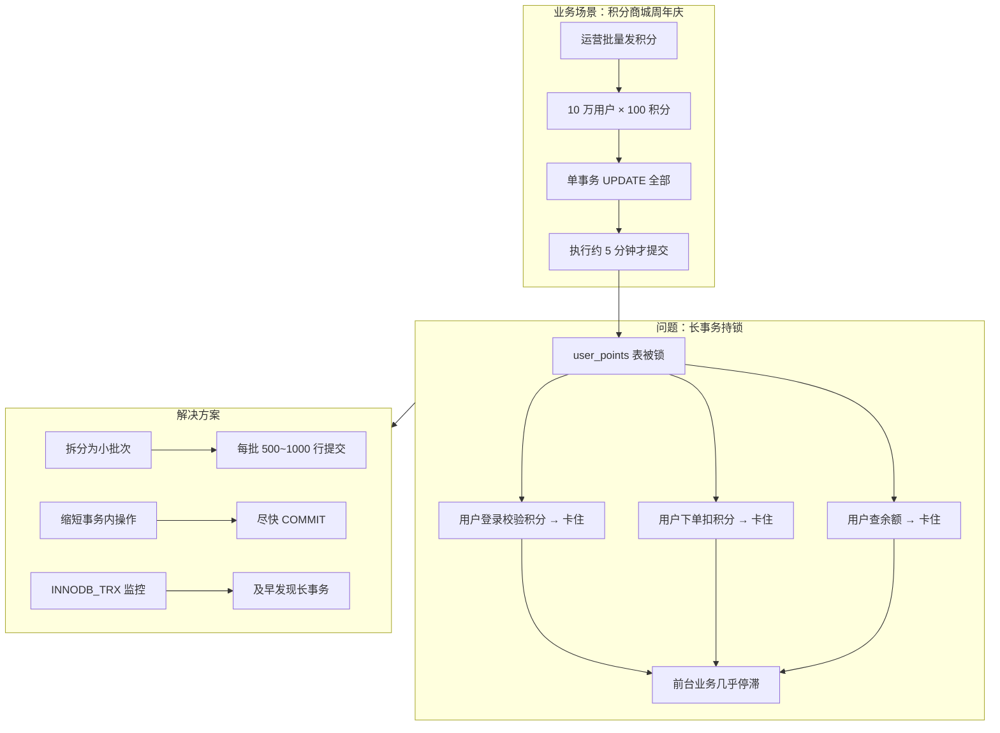

# 案例 03：大事务

## 图示：场景 → 问题 → 解决方案



## 业务需求场景

**运营批量给用户发积分导致系统卡死**

某积分商城做周年庆活动，运营需要在后台给 **10 万用户** 每人增加 100 积分。开发写的脚本如下：

```sql
BEGIN;
UPDATE user_points SET points = points + 100 WHERE user_id IN (1, 2, 3, ..., 100000);
COMMIT;
```

- 单事务内更新 10 万行
- 事务执行约 **5 分钟** 才提交
- 这 5 分钟内，**所有涉及 user_points 表的操作都被阻塞**：
  - 用户登录时校验积分 → 卡住
  - 用户下单扣积分 → 卡住
  - 用户查询积分余额 → 卡住
- 前台业务几乎停滞，用户大量投诉

## 涉及的技术概念

- **大事务**：单事务内修改/插入行数过多
- **锁持有时间**：事务不提交，锁一直持有
- **INNODB_TRX**：可查询当前运行中的事务、已修改行数、已锁行数
- **批量化小**：将大批量拆成多小批，每批提交一次

## 对业务的影响

- **直接影响**：相关表上的读写在事务期间全部等待
- **间接影响**：主从复制延迟、undo 日志膨胀、回滚时间长
- **业务感知**：前台"卡死"，后台脚本看似在跑，实则拖垮整个库

## 与 mysql-ops-learning 的对应

| 工具操作 | 作用 |
|----------|------|
| Run: 模拟大事务 | 创建表并单事务更新 1 万行，体验长事务持有锁的影响 |
| Run: 检测长事务 | 查询 INNODB_TRX，查看事务开始时间、已修改/锁定行数 |

## 学习要点

理解「事务越大、持锁越久」，对其它请求的阻塞越严重；学会拆分为小批次、及时提交，以及通过 INNODB_TRX 早期发现长事务。
