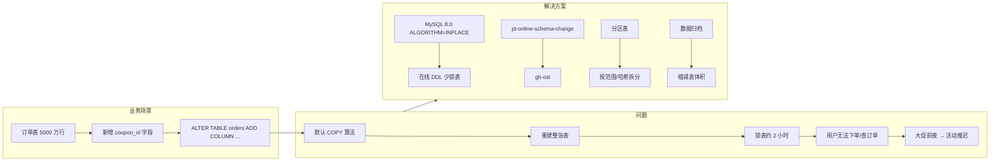

# 案例 04：大表问题

## 图示：场景 → 问题 → 解决方案



## 业务需求场景

**订单表加字段导致停服 2 小时**

某电商平台运营一年后，订单表 `orders` 已有 **5000 万行**。产品需要新增一个字段 `coupon_id` 用于记录使用的优惠券。DBA 执行：

```sql
ALTER TABLE orders ADD COLUMN coupon_id BIGINT DEFAULT NULL;
```

- 默认算法为 COPY，MySQL 会重建整张表
- 执行时间约 **2 小时**，期间 **表被锁定**
- 用户无法下单、无法查询订单，业务停摆
- 大促前夜执行，导致活动推迟，损失严重

## 涉及的技术概念

- **大表**：行数多、物理体积大的表
- **DDL 锁表**：传统 ALTER 会锁表，阻塞 DML
- **在线 DDL**：MySQL 8.0 的 ALGORITHM=INPLACE、pt-online-schema-change、gh-ost 等可在不长时间锁表的情况下改表
- **分区**：按范围/哈希拆分大表，便于管理和归档

## 对业务的影响

- **直接影响**：ALTER 期间该表不可用，依赖该表的功能全部受影响
- **间接影响**：必须在低峰期执行，排期紧张；大表备份、恢复也变慢
- **风险**：执行中若失败或中断，回滚成本高

## 与 mysql-ops-learning 的对应

| 工具操作 | 作用 |
|----------|------|
| Run: 模拟大表 | 创建表并插入 10 万行，模拟表变大的过程 |
| Run: 分析表大小 | 查询 information_schema.TABLES，查看各表数据量、索引占用 |

## 学习要点

理解大表对 DDL、备份、查询的影响；了解分区、在线 DDL 工具和归档策略，避免"加个字段停服两小时"的情况。
