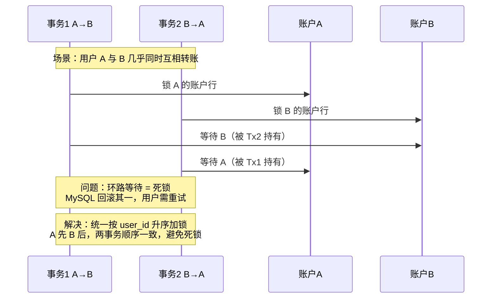
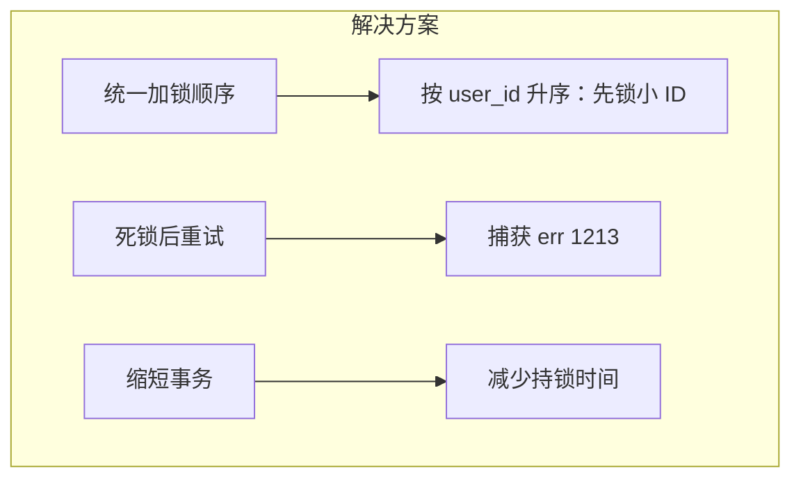

# 案例 05：死锁

## 图示：场景 → 问题 → 解决方案

## 业务需求场景

**用户互相转账导致偶发交易失败**

某钱包/社交应用支持用户间转账。两个用户几乎同时操作：

- 用户 A 给用户 B 转 100 元
- 用户 B 给用户 A 转 50 元

两笔交易的事务逻辑均为：先锁转出方账户，再锁转入方账户，然后扣款、加款。具体执行顺序：

- 事务 1（A→B）：锁 A 的账户行，等待 B 的账户行
- 事务 2（B→A）：锁 B 的账户行，等待 A 的账户行
- 形成 **环路等待**，MySQL 检测到死锁，回滚其中一个事务
- 用户看到「交易失败，请重试」，重试后通常成功

## 涉及的技术概念

- **死锁**：多个事务互相等待对方持有的锁
- **加锁顺序**：若所有事务都按相同顺序加锁（如按 user_id 升序），可避免死锁
- **死锁检测**：InnoDB 自动检测并回滚代价较小的事务
- **重试**：应用层捕获死锁错误（err 1213）后重试

## 对业务的影响

- **直接影响**：少数请求失败，用户需重试
- **间接影响**：若重试逻辑不当，可能重复扣款/加款；频繁死锁会拉高失败率
- **业务感知**：用户感觉"有时能转、有时不能"，体验不佳

## 与 mysql-ops-learning 的对应

| 工具操作 | 作用 |
|----------|------|
| Run: 模拟死锁 | 两个 goroutine 以相反顺序更新两表，触发死锁 |
| Run: 查看死锁信息 | 输出 SHOW ENGINE INNODB STATUS 中的 LATEST DETECTED DEADLOCK |

## 学习要点

理解死锁的成因（加锁顺序不一致）；学会通过统一加锁顺序、缩短事务、重试逻辑来减少或消化死锁。
