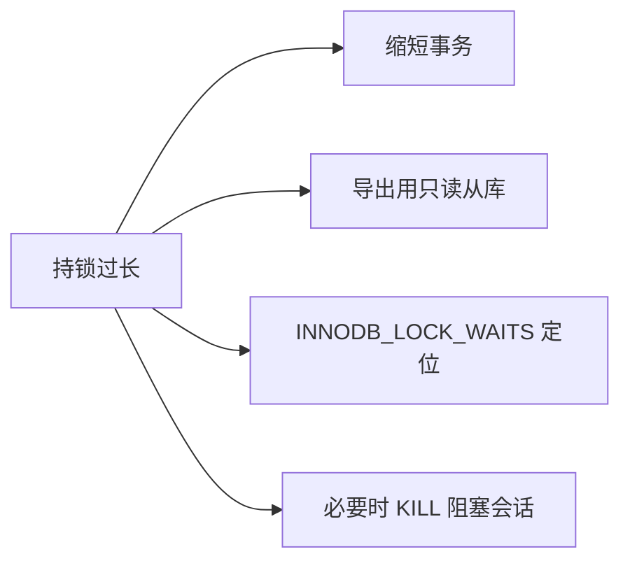

# 案例 06：锁等待超时

## 图示：场景 → 问题 → 解决方案

```mermaid
sequenceDiagram
    participant 后台 as 后台导出脚本
    participant 用户 as 前台用户
    participant DB as users 表

    Note over 后台,DB: 场景：后台导出报表，前台用户修改头像

    后台->>DB: BEGIN; SELECT * FROM users 持锁
    Note over 后台: 长时间不提交（处理数据）
    用户->>DB: UPDATE users SET avatar=? WHERE id=?
    用户->>用户: 等待排他锁...
    Note over 用户: 超过 50 秒
    DB-->>用户: Lock wait timeout exceeded
    用户->>用户: 修改失败，请重试

    Note over 后台,用户: 解决：缩短持锁 / 导出用从库
```



## 业务需求场景

**后台导出报表阻塞用户修改资料**

某 SaaS 平台，运营在后台执行「导出全部用户报表」功能。脚本逻辑：

- 开启事务，执行 `SELECT * FROM users` 全表扫描
- 为保持一致性，事务内加共享锁，且 **长时间不提交**（脚本还在做后续处理）
- 与此同时，前台用户尝试更新自己的头像、昵称等：`UPDATE users SET avatar=? WHERE id=?`
- 该更新需要排他锁，需等待后台事务释放锁
- 等待超过 **50 秒**（`innodb_lock_wait_timeout` 默认值）后，MySQL 返回 "Lock wait timeout exceeded"
- 用户看到「修改失败，请重试」

## 涉及的技术概念

- **innodb_lock_wait_timeout**：锁等待超时时间（秒），默认 50
- **锁类型**：共享锁（读）、排他锁（写）
- **阻塞链**：A 持锁 → B 等待 A → C 等待 B ...
- **INNODB_LOCK_WAITS**：可查询谁在等谁的锁

## 对业务的影响

- **直接影响**：被阻塞的写操作超时失败
- **间接影响**：用户误以为系统有问题；若重试逻辑不当，可能覆盖脏数据
- **根因**：长事务持锁、大查询持锁未及时释放

## 与 mysql-ops-learning 的对应

| 工具操作 | 作用 |
|----------|------|
| Run: 模拟等待 | 连接 1 持锁 10 秒不提交，连接 2 尝试更新同一行，体验锁等待与超时 |

## 学习要点

理解「持锁时间过长」会阻塞其他事务；学会通过 INNODB_LOCK_WAITS 定位阻塞关系，以及何时需要 KILL 阻塞会话。
