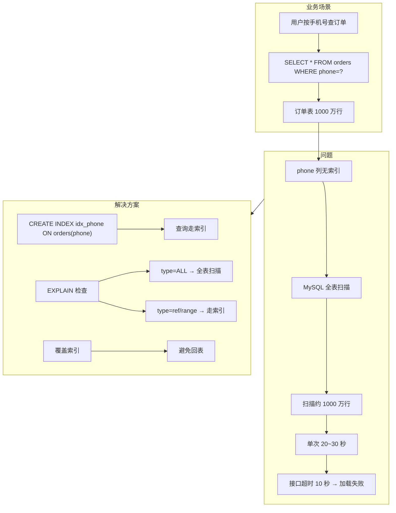
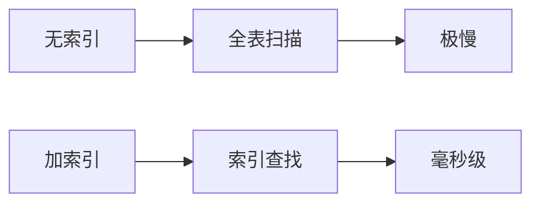

# 案例 07：索引使用不当

## 图示：场景 → 问题 → 解决方案





## 业务需求场景

**用户按手机号查订单导致接口超时**

某外卖平台的订单表 `orders` 有 **1000 万行**。用户在前端输入手机号查询自己的订单，接口 SQL 为：

```sql
SELECT * FROM orders WHERE phone = '13800138000' ORDER BY created_at DESC LIMIT 20;
```

- 表上有 `PRIMARY KEY (id)`，但 **phone 列无索引**
- MySQL 只能 **全表扫描**，每次查询扫描约 1000 万行
- 单次查询耗时 **20~30 秒**
- 接口超时（如 10 秒），用户看到"加载失败"
- 该功能使用频繁，数据库 CPU 长期偏高

## 涉及的技术概念

- **全表扫描**：无可用索引时，逐行遍历整表
- **EXPLAIN**：查看执行计划，type=ALL 表示全表扫描
- **覆盖索引**：索引包含查询所需列，可避免回表
- **索引选择性**：区分度高的列更适合建索引

## 对业务的影响

- **直接影响**：查询极慢，接口超时
- **间接影响**：占用大量 CPU、IO，拖累同实例上的其他查询
- **易忽略**：数据量小时不明显，数据量上来后突然变慢

## 与 mysql-ops-learning 的对应

| 工具操作 | 作用 |
|----------|------|
| Run: 模拟全表扫描 | 创建无索引表并插入 5 万行，按 email 查询触发全表扫描 |
| Run: 查看执行计划 | 对问题 SQL 执行 EXPLAIN，查看 type、rows、key 等 |

## 学习要点

理解「无索引 = 全表扫描」；学会用 EXPLAIN 判断是否走索引、扫描行数是否合理；掌握常见字段（WHERE、ORDER BY、JOIN）的索引设计原则。
