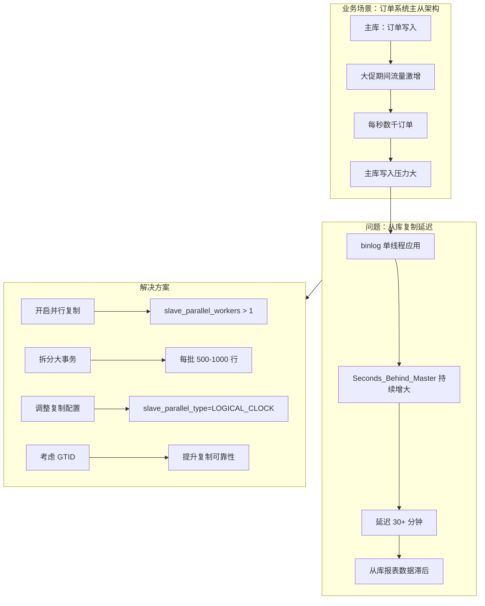

# 案例 08：主从复制延迟

## 图示：场景 → 问题 → 解决方案

## 业务需求场景

**订单系统主从架构**

某电商平台的订单系统采用主从复制架构：
- **主库**：承担所有订单写入、支付、库存扣减等写操作
- **从库**：承担报表查询、数据分析、备份等只读操作

日常运行正常，大促期间出现严重问题：

- **大促流量**：双 11 凌晨 0 点，大量用户下单，**每秒产生数千笔订单**
- **主库负载**：主库写入压力巨大，binlog 快速生成
- **从库延迟**：从库采用**默认单线程复制**，binlog 应用速度跟不上
- **现象**：Seconds_Behind_Master 从 0 逐渐增长到 **1800+ 秒（30 分钟）**
- **业务影响**：运营人员查看实时报表时，数据始终滞后 30 分钟以上，无法及时了解销售情况
- **投诉**：客服收到大量投诉，"为什么订单已支付但后台查不到？"

## 涉及的技术概念

- **主从复制 (Master-Slave Replication)**：MySQL 经典架构，主库写、从库读
- **binlog**：MySQL 二进制日志，记录所有数据变更
- **Slave_IO_Running**：从库 IO 线程，负责读取主库 binlog
- **Slave_SQL_Running**：从库 SQL 线程，负责应用 binlog
- **Seconds_Behind_Master**：从库延迟秒数（从库与应用 pos 的时间差）
- **并行复制**：多线程并行应用 binlog，提升从库消费速度
- **LOGICAL_CLOCK**：基于逻辑时钟的并行复制策略
- **GTID**：全局事务 ID，提供更可靠的复制拓扑

## 对业务的影响

- **报表数据滞后**：运营无法看到实时销售数据，影响决策
- **读写未分离**：从库延迟过高，业务被迫走主库读取，加重主库负担
- **备份失效**：从库备份数据已过时，备份失去意义
- **故障切换风险**：主库故障时，从库数据不完整，无法立即切换

## 与 mysql-ops-learning 的对应

| 工具操作 | 作用 |
|----------|------|
| Run: 模拟写入 | 在主库模拟大量写入（大事务），观察从库延迟变化 |
| Run: 监控状态 | 查看 Seconds_Behind_Master、IO/SQL 线程状态 |
| Run: 检测配置 | 检查并行复制配置，提供优化建议 |

## 学习要点

1. **单线程复制的瓶颈**：默认情况下，从库只有一个 SQL 线程应用 binlog，大流量写入时容易成为瓶颈
2. **并行复制是关键**：开启并行复制（slave_parallel_workers）可显著降低延迟
3. **大事务加剧延迟**：单次事务过大，binlog 传输和应用时间更长
4. **监控重要性**：持续监控 Seconds_Behind_Master，及时发现复制延迟
