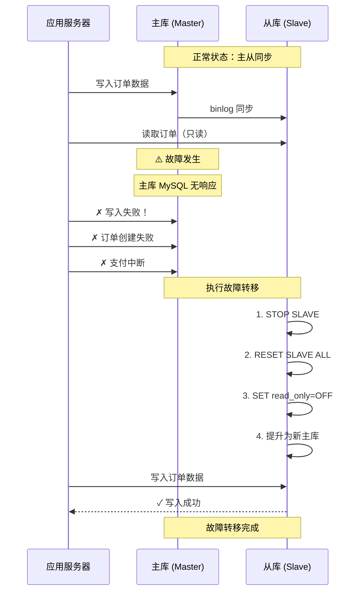
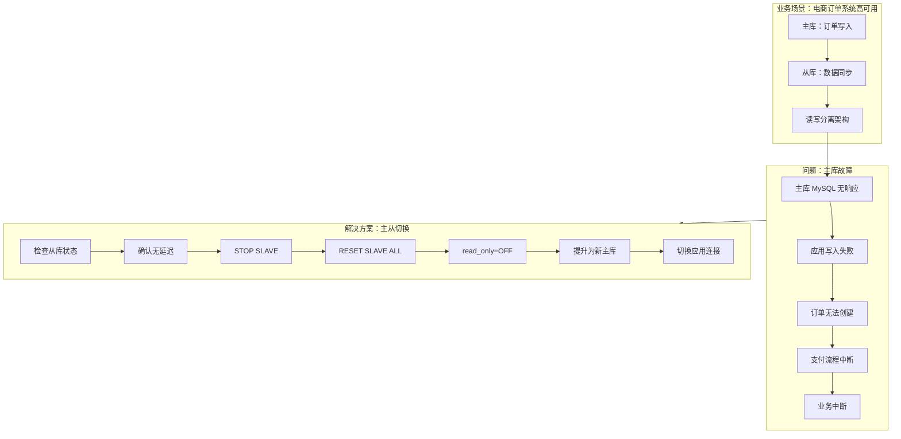

# 案例 10：故障转移（主从切换）

## 图示：场景 → 问题 → 解决方案

## 业务需求场景

**电商平台订单系统高可用架构**

某电商平台采用 MySQL 主从架构实现高可用：

- **主库 (Master)**：负责所有写入操作（订单、支付、库存）
- **从库 (Slave)**：负责读取操作（商品查询、订单状态查看）
- **读写分离**：写入走主库，读取优先走从库

**故障发生场景：**

- **时间**：工作日下午 14:30
- **事件**：主库 MySQL 服务无响应
- **原因**：硬件故障/网络中断/数据库崩溃（模拟）
- **影响**：
  - 用户无法下单（写入请求失败）
  - 支付流程中断
  - 订单创建失败
  - 客服投诉激增
  - **业务中断计时开始...**

## 涉及的技术概念

- **主从复制 (Master-Slave Replication)**：MySQL 高可用基础架构
- **读写分离**：写入主库、读取从库，分担负载
- **故障转移 (Failover)**：主库故障时将从库提升为主库的过程
- **read_only**：从库只读模式，防止意外写入
- **super_read_only**：超级用户也无法写入的只读模式
- **STOP SLAVE**：停止从库复制
- **RESET SLAVE ALL**：清除从库复制配置
- **GTID**：全局事务 ID（简化故障转移）
- **MGR (MySQL Group Replication)**：未来自动故障转移方案

## 对业务的影响

- **服务中断**：写入请求失败，业务无法正常进行
- **用户流失**：无法下单导致用户体验极差
- **数据丢失风险**：若从库数据未完全同步，切换将导致数据丢失
- **财务风险**：支付中断可能引发客户投诉和纠纷
- **运维压力**：DBA 需要紧急响应，执行手动故障转移

## 与 mysql-ops-learning 的对应

| 工具操作 | 作用 |
|----------|------|
| `go run ./cmd run 10-failover reproduce` | 模拟业务场景，展示故障发生前后状态 |
| `go run ./cmd run 10-failover prepare` | 准备阶段：检查从库状态，确认数据同步 |
| `go run ./cmd run 10-failover switch` | 执行切换：将从库提升为主库 |
| `go run ./cmd run 10-failover verify` | 验证结果：检查数据一致性和服务状态 |

## 学习要点

1. **故障转移的必要性**：单主库架构下，主库故障将导致业务完全中断
2. **数据一致性是关键**：切换前必须确认从库已同步最新数据（Seconds_Behind_Master = 0）
3. **手动 vs 自动**：手动故障转移依赖 DBA 响应，自动故障转移可使用 MGR 或 Keepalived
4. **read_only 陷阱**：故障转移后必须关闭 read_only，否则仍无法写入
5. **应用切换**：数据库切换后需要更新应用连接配置
6. **善后处理**：原主库修复后需重新建立主从关系
