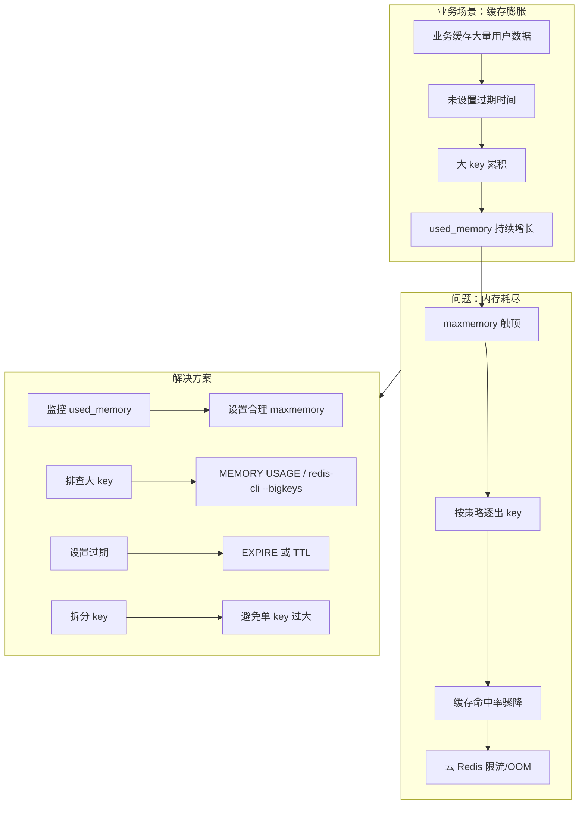

# 案例 01：内存占用高

## 图示：场景 → 问题 → 解决方案

## 业务需求场景

**社交 App 用户会话缓存**

某社交 App 使用 Redis 缓存用户在线状态和最近会话。上线半年后：

- 累计缓存 **数千万** 用户会话，未设置过期
- 部分 key 为 `user:sessions:{uid}`，存储 JSON 数组，单 key 达 **数 MB**
- `used_memory` 从 2GB 增长到 **12GB**，逼近实例 maxmemory 16GB
- 触发逐出后，**缓存命中率从 95% 降到 40%**
- 数据库压力骤增，接口 P99 从 50ms 升到 800ms
- 阿里云 Redis 因超限触发限流，部分请求报错

## 涉及的技术概念

- **used_memory**：Redis 当前已分配内存
- **maxmemory**：内存上限，超限后按 maxmemory-policy 逐出
- **MEMORY USAGE key**：查看单个 key 占用（Redis 4.0+）
- **redis-cli --bigkeys**：采样找出大 key

## 对业务的影响

- **直接影响**：缓存失效，数据库压力剧增，接口变慢
- **间接影响**：用户体验下降，云 Redis 超限可能产生额外费用
- **量化示例**：缓存命中率每降 10%，数据库 QPS 约增 2 倍

## 与 redis-ops-learning 的对应

| 工具操作 | 作用 |
|----------|------|
| Run: 查看内存 | 执行 INFO memory，查看 used_memory、maxmemory 等 |
| Run: 大 key 采样 | SCAN + MEMORY USAGE 采样，找出占用较大的 key |

## 学习要点

理解内存监控的重要性；掌握 MEMORY USAGE 和 --bigkeys 排查大 key；合理设置过期时间和 maxmemory-policy。
