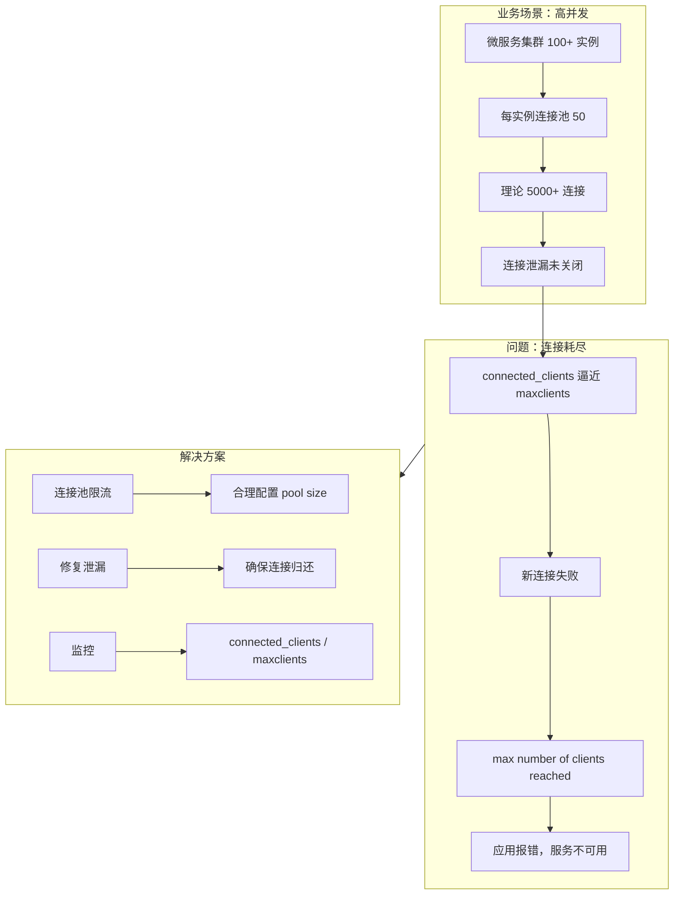

# 案例 02：连接数耗尽

## 图示：场景 → 问题 → 解决方案

## 业务需求场景

**微服务调用 Redis 连接泄漏**

某公司微服务架构，每个服务实例使用 Redis 连接池。某次发布引入 bug：在异常分支未正确释放连接。

- 集群 **80 个** 实例，每实例池大小 50，理论 4000 连接
- 云 Redis 实例 maxclients = **5000**
- 泄漏导致每实例实际占用 **60+** 连接
- 约 1 小时后，**新请求报错**："max number of clients reached"
- 全部服务无法访问 Redis，业务全面中断

## 涉及的技术概念

- **connected_clients**：当前已连接客户端数
- **maxclients**：Redis 允许的最大连接数（默认 10000，云 Redis 可能更低）
- **blocked_clients**：阻塞在 BLPOP 等命令的客户端数

## 对业务的影响

- **直接影响**：无法连接 Redis，缓存/会话/队列全部不可用
- **间接影响**：级联失败，需紧急回滚或扩容

## 与 redis-ops-learning 的对应

| 工具操作 | 作用 |
|----------|------|
| Run: 查看连接 | 执行 INFO clients，查看 connected_clients、maxclients |

## 学习要点

理解连接池与 maxclients 的关系；监控 connected_clients；排查连接泄漏。
