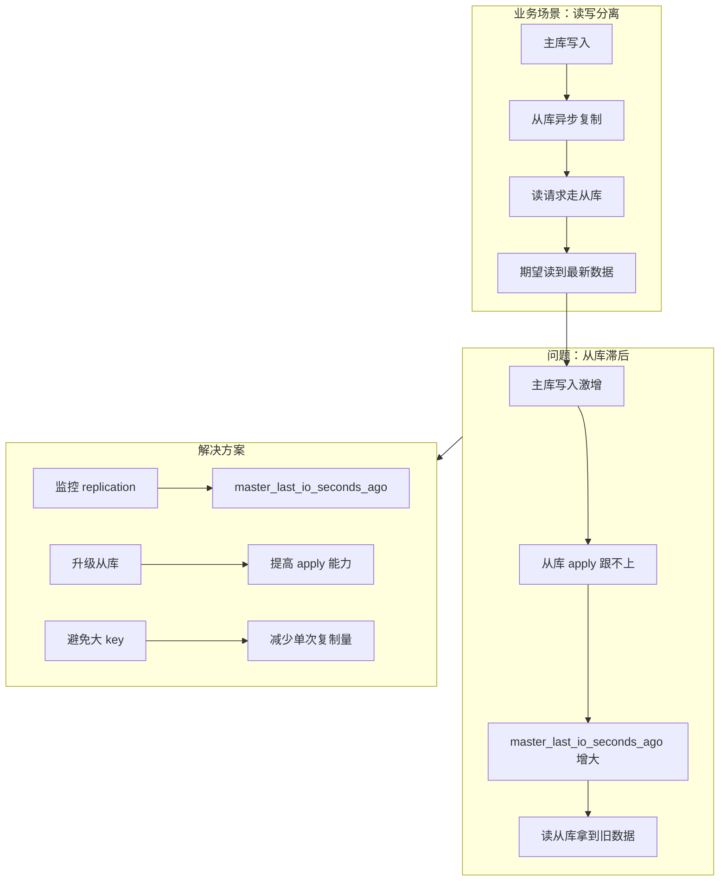

# 案例 04：主从延迟

## 图示：场景 → 问题 → 解决方案

## 业务需求场景

**报表系统读写分离读到旧数据**

某公司报表系统采用 Redis 主从，主库写、从库读。某次数据迁移脚本批量写入 100 万条记录。

- 主库写入 **10 分钟** 完成
- 从库复制落后，**master_last_io_seconds_ago 达 300+ 秒**
- 报表查询走从库，展示的是 **5 分钟前** 的数据
- 运营误判数据异常，引发排查

## 涉及的技术概念

- **INFO replication**：主从复制状态
- **master_last_io_seconds_ago**：距上次与主库通信的秒数
- **role**：master 或 slave

## 对业务的影响

- **直接影响**：读写分离场景下，读到的数据可能滞后
- **间接影响**：强一致性场景需读主库或等待同步

## 与 redis-ops-learning 的对应

| 工具操作 | 作用 |
|----------|------|
| Run: 查看复制状态 | INFO replication |

## 学习要点

理解异步复制的滞后性；监控 replication 指标；读写分离需接受最终一致性。
