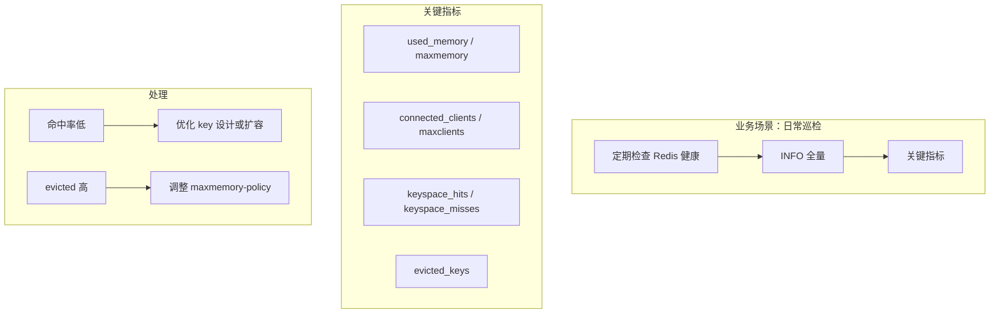

# 案例 05：运行统计

## 图示：场景 → 问题 → 解决方案

## 业务需求场景

**日常 Redis 健康巡检**

DBA 每周巡检 Redis 实例，关注：

- **内存**：used_memory 是否逼近 maxmemory
- **连接**：connected_clients 是否异常
- **命中率**：keyspace_hits / (hits + misses)
- **逐出**：evicted_keys 是否持续增长

## 涉及的技术概念

- **INFO server**：服务器信息
- **INFO memory**：内存
- **INFO stats**：命令统计、命中率、evicted 等

## 与 redis-ops-learning 的对应

| 工具操作 | 作用 |
|----------|------|
| Run: INFO 全量 | server, clients, memory, stats |
| Run: 命令统计 | INFO stats |

## 学习要点

掌握 INFO 各 section 含义；定期巡检关键指标；建立监控告警。
