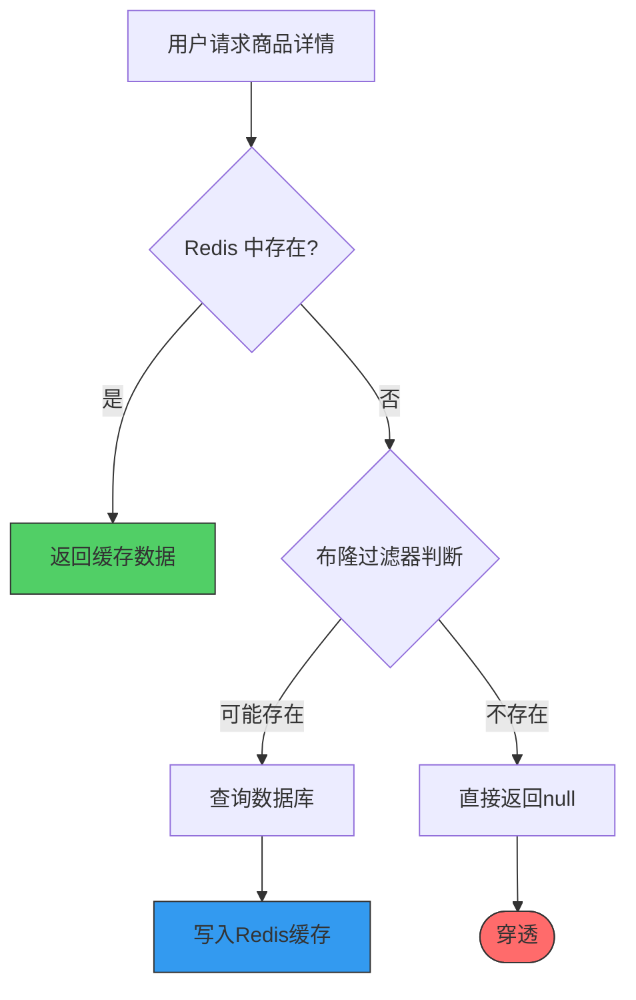

# 案例 06：缓存穿透 (Cache Penetration)

## 图示：场景 → 问题 → 解决方案



## 业务需求场景

### 典型场景：电商商品查询

在电商平台中，用户浏览商品详情页是核心功能。商品数据通常缓存到 Redis 以提升查询性能。

**但存在以下情况会导致问题：**

1. **已下架商品** - 商品因违规或库存为 0 已下架，但仍有用户通过分享链接或搜索结果访问
2. **不存在商品** - 用户输入错误或猜测商品 ID（如 `product:999999`）
3. **恶意请求** - 攻击者故意大量请求不存在的 key 进行打击

### 业务逻辑

```
用户请求 → Redis 查询 → 缓存命中 → 返回数据
                ↓
           缓存未命中
                ↓
           查询数据库 → 返回数据 → 写入缓存
```

**问题核心**：当请求的 key 既不在缓存也不在数据库时，每次请求都会穿透到数据库。

## 涉及的技术概念

### 1. 缓存穿透 (Cache Penetration)

指查询一个**不存在**的数据，由于缓存不命中，每次请求都穿透到数据库。大量穿透请求会导致数据库压力剧增。

**危害**：
- 数据库负载异常升高
- 缓存命中率下降
- 可能被恶意攻击（大量请求不存在的数据）

### 2. 空值缓存 (Null Cache)

**解决方案之一**：将查询结果为空的数据也缓存到 Redis，设置较短的 TTL（如 30 秒）。

```
第1次请求 product:9999 → DB 无数据 → 缓存 NULL，TTL=30s
第2次请求 product:9999 → 命中空值缓存 → 直接返回 null → 无 DB 访问
```

**优点**：简单有效
**缺点**：需要管理空值的 TTL

### 3. 布隆过滤器 (Bloom Filter)

**更优方案**：使用布隆过滤器在缓存层之前做快速判断。

```
布隆过滤器存储所有真实存在的 key
请求到达 → 布隆过滤器判断 → 不存在 → 直接返回
                         → 可能存在 → 查缓存/DB
```

**优点**：
- 内存占用极低（位图实现）
- 判断速度快 O(k)
- 完全防止不存在的 key 穿透

**缺点**：
- 存在误判率（false positive）
- 不支持删除（可用 Count-Min Sketch 或分层布隆过滤器）

### 4. CacheAside 模式

经典缓存模式：
- **读**：先缓存，后数据库
- **写**：先数据库，后删除缓存

## 对业务的影响

| 影响项 | 描述 |
|--------|------|
| **数据库负载** | 穿透请求直接打 DB，CPU 和连接数飙升 |
| **响应延迟** | DB 查询比缓存慢 10-100 倍 |
| **可用性** | DB 过载可能导致服务不可用 |
| **成本** | 云数据库按量计费时被攻击可能导致费用激增 |

### 真实案例

某电商平台被恶意刷接口，攻击者随机猜测商品 ID 进行大量请求：
- 正常 QPS：1000/秒
- 攻击时 QPS：10,000/秒
- DB CPU：从 30% 飙升至 100%
- 缓存命中率：从 95% 降至 20%

## 与 redis-ops-learning 的对应

### 案例文件

- **Go 实现**：`problems/cache-penetration/cache-penetration.go`
- **执行命令**：
  ```bash
  # 查看穿透演示
  go run ./cmd run 06-cache-penetration info
  
  # 模拟空值缓存
  go run ./cmd run 06-cache-penetration simulate
  
  # 布隆过滤器方案
  go run ./cmd run 06-cache-penetration bloom
  ```

### 演示内容

1. **info** - 展示查询不存在 key 的行为及统计指标
2. **simulate** - 模拟空值缓存防止穿透
3. **bloom** - 演示布隆过滤器防穿透方案

## 学习要点

### 1. 识别穿透

```bash
# 查看 keyspace 统计
redis-cli INFO stats | grep keyspace

# keyspace_hits: 缓存命中
# keyspace_misses: 缓存未命中
# 命中率 = hits / (hits + misses)
```

### 2. 解决方案对比

| 方案 | 适用场景 | 优点 | 缺点 |
|------|----------|------|------|
| **空值缓存** | 数据确定性为空 | 简单，无需额外组件 | 需要管理 TTL |
| **布隆过滤器** | 数据量巨大，存在集合 | 内存小，判断快 | 有误判率 |
| **分布式锁** | 并发严重的写 | 保证一致性 | 有性能开销 |

### 3. 最佳实践

1. **入口校验**：参数合法性检查，过滤明显无效请求
2. **布隆过滤器**：作为第一道防线，判断 key 是否可能存在
3. **空值缓存**：作为第二道防线，缓存空结果
4. **监控告警**：keyspace_misses 异常升高时告警

### 4. 注意事项

- 空值缓存 TTL 不宜过长（数据可能变存在）
- 布隆过滤器需要预热（提前加载真实存在的 key）
- 恶意请求需结合 IP 限流、验证码等措施
