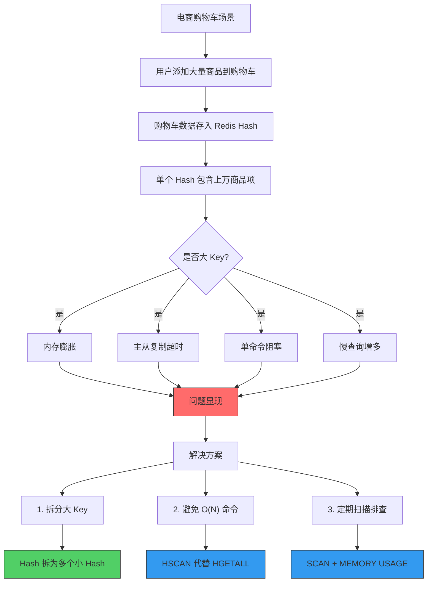

# 案例 07：大 Key 问题 (Big Key Problem)

## 图示：场景 → 问题 → 解决方案



## 业务需求场景

### 典型场景：电商购物车

在电商平台中，**购物车**是核心功能之一。用户将商品加入购物车时，需要存储以下信息：

- 商品 ID 和名称
- 商品数量
- 价格信息
- 规格属性
- 添加时间

**实现方式**：使用 Redis Hash 存储购物车数据，`key` 为 `cart:user:xxxxx`，`field` 为商品 ID，`value` 为商品信息 JSON。

**问题**：当用户购物车中有大量商品时（例如代购商、批发商），单个 Hash 可能包含 **数万甚至数十万字段**。

### 业务逻辑

```
用户 A (普通) → 购物车 5-10 件商品 → Hash 字段 < 100 → 正常
用户 B (批发商) → 购物车 10000+ 件商品 → Hash 字段 > 10000 → 大 Key 问题！
```

### 其他常见大 Key 场景

| 场景 | 数据结构 | 问题原因 |
|------|----------|----------|
| 社交 Feed 流 | List | 关注者众多，Feed 列表超长 |
| 商品详情缓存 | Hash | 商品属性过多 |
| 用户画像 | Hash | 累积大量用户标签 |
| 排行榜 | ZSet | 榜单数据庞大 |
| 缓存文件/图片 | String | Value 过大（>1MB） |

## 涉及的技术概念

### 1. Redis 大 Key

**定义**：Redis 单个 Key 或 Key 中存储的数据量过大。

**常见阈值**：
- String 类型：> 10KB
- Hash/List/Set/ZSet：> 10,000 元素

**Redis 官方建议**：
- 字符串类型：控制在 512MB 以内（实际建议 < 10MB）
- 哈希/列表/集合/有序集合：元素数量 < 10,000

### 2. MEMORY USAGE 命令

```bash
# 查看单个 key 的内存占用
MEMORY USAGE key

# 返回字节数
# 例如：MEMORY USAGE cart:user:1001
# => (integer) 1234567
```

### 3. SCAN vs KEYS

```bash
# ❌ 禁止使用：会阻塞 Redis
KEYS *

# ✅ 推荐使用：游标遍历，不阻塞
SCAN 0 MATCH * COUNT 1000
```

### 4. O(N) 命令风险

| 命令 | 复杂度 | 大 Key 风险 |
|------|--------|--------------|
| HGETALL | O(N) | 返回所有字段，阻塞 |
| LRANGE | O(N) | 返回范围内所有元素 |
| SMEMBERS | O(N) | 返回所有成员 |
| ZRANGE | O(N) | 返回范围内所有元素 |
| KEYS * | O(N) | 遍历所有 key |

**安全替代**：
- HSCAN → HGETALL
- SSCAN → SMEMBERS
- ZSCAN → ZRANGE
- SCAN → KEYS

### 5. 大 Key 拆分策略

**Hash 拆分**：
```
# 原始 (1个大Hash)
user:1001:profile → {field1: val1, field2: val2, ...}

# 拆分后 (多个小Hash)
user:1001:basic   → {field1: val1, ...}
user:1001:attrs   → {fieldN: valN, ...}
user:1001:stats   → {...}
```

**List 拆分**：
```
# 原始 (1个大List)
feed:user:1001 → [item1, item2, ..., item10000]

# 拆分后 (多个小List)
feed:user:1001:page1 → [item1-1000]
feed:user:1001:page2 → [item1001-2000]
```

## 对业务的影响

### 1. 内存问题

- 单个大 Key 可能占用 **数百 MB 甚至 GB** 内存
- 触发 Redis 内存 maxmemory 限制
- 导致 key 逐出（eviction）或 OOM

### 2. 性能问题

- O(N) 命令需要遍历所有元素，**阻塞 Redis 主线程**
- 单次操作耗时可能达到 **秒级**
- 影响其他请求的响应时间

### 3. 主从复制问题

- 主从同步时，大 Key 需要完整传输
- 网络带宽占用高
- 可能导致复制超时断开

### 4. 运维问题

- `BGSAVE` 或 `AOF rewrite` 时，fork 操作可能超时
- 慢查询日志增多
- 问题定位困难

### 真实案例

某电商大促期间：
- 用户购物车 Key 达到 **50MB**（10000+ 商品）
- `HGETALL` 命令执行时间 **3 秒**
- 导致该用户所有请求超时
- 最终触发集群雪崩

## 与 redis-ops-learning 的对应

### 案例文件

- **Go 实现**：`problems/bigkey/bigkey.go`
- **执行命令**：
  ```bash
  # 查看大 Key 基本信息
  go run ./cmd run 07-bigkey info
  
  # 扫描数据库中的大 Key
  go run ./cmd run 07-bigkey scan
  
  # 演示大 Key 问题
  go run ./cmd run 07-bigkey demo
  
  # 演示大 Key 拆分方案
  go run ./cmd run 07-bigkey split
  ```

### 演示内容

1. **info** - 查看 Redis 内存信息和 keyspace 统计
2. **scan** - 扫描数据库，列出所有 > 10KB 的大 Key
3. **demo** - 创建大 Hash/List/String，演示 HGETALL 阻塞问题
4. **split** - 演示 Hash 拆分方法，用 HSCAN 替代 HGETALL

## 学习要点

### 1. 识别大 Key

```bash
# 方法1：redis-cli --bigkeys（采样分析）
redis-cli --bigkeys

# 方法2：SCAN + MEMORY USAGE
redis-cli SCAN 0 MATCH * COUNT 1000 | while read key; do
  echo "$key: $(redis-cli MEMORY USAGE $key)"
done

# 方法3：MEMORY STATS（Redis 4.0+）
MEMORY STATS
```

### 2. 大 Key 监控

```bash
# 在 redis.conf 中开启
notify-keyspace-events Kh

# 使用 Redis Stack 的 RediSearch 或 RedisGears
```

### 3. 解决方案对比

| 方案 | 适用场景 | 优点 | 缺点 |
|------|----------|------|------|
| **拆分** | Hash/List/ZSet 元素过多 | 从根本上解决问题 | 需要改代码 |
| **压缩** | String 类型 value 过大 | 减少内存 | 增加 CPU 开销 |
| **过期** | 非必要长期存储 | 释放内存 | 可能影响功能 |
| **定期清理** | 临时数据 | 释放空间 | 需要定时任务 |

### 4. 最佳实践

1. **设计阶段**：预估数据量，避免单 Key 过大
2. **开发阶段**：使用 O(N) 命令时注意数据量
3. **运维阶段**：
   - 定期扫描大 Key
   - 监控 MEMORY USAGE
   - 告警阈值设置
4. **应急处理**：
   - 使用 SCAN 渐进式删除
   - 拆分后再删除

### 5. 注意事项

- 删除大 Key 也会阻塞，使用 `UNLINK` 代替 `DEL`（异步删除）
- 主从环境中，删除操作会同步，需要注意
- 拆分后可能增加网络请求次数，需要权衡
